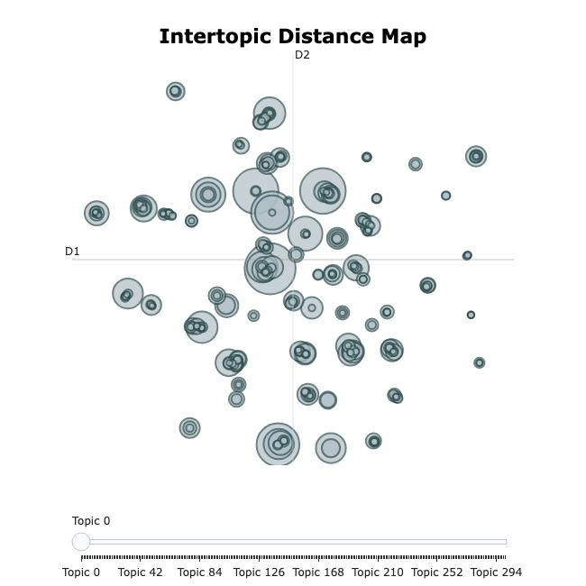
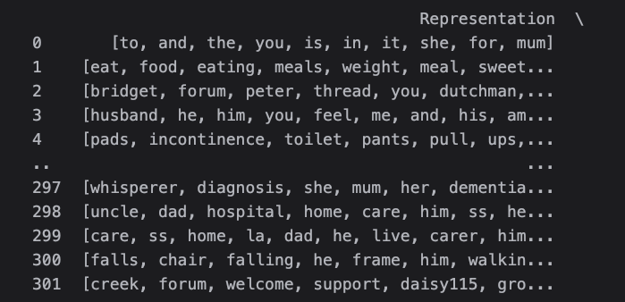
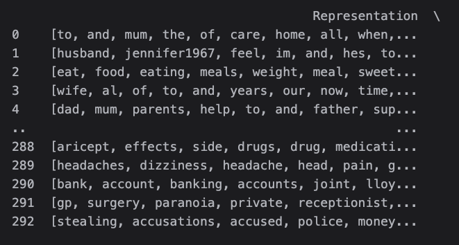
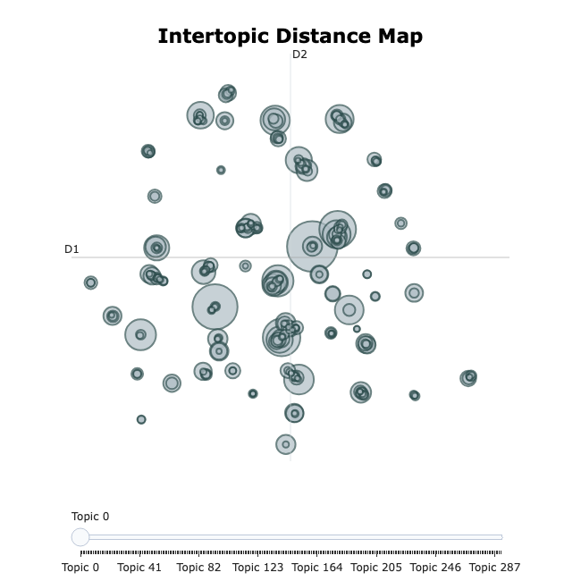
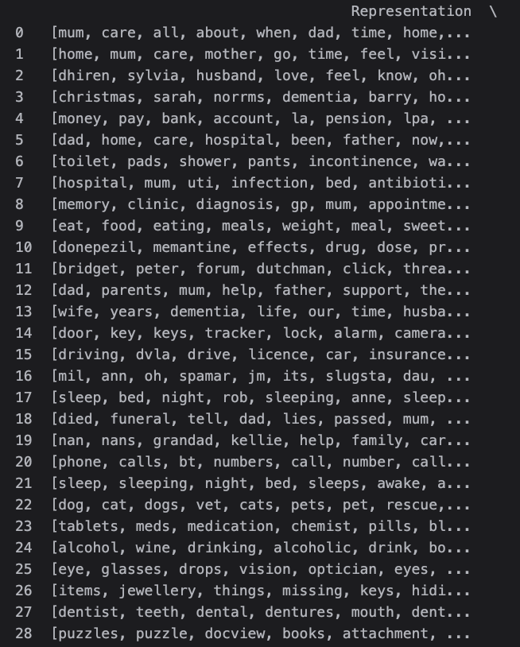
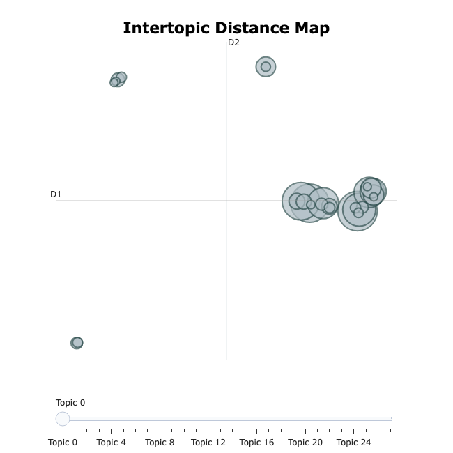
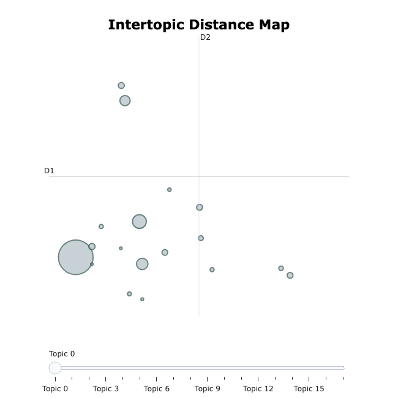
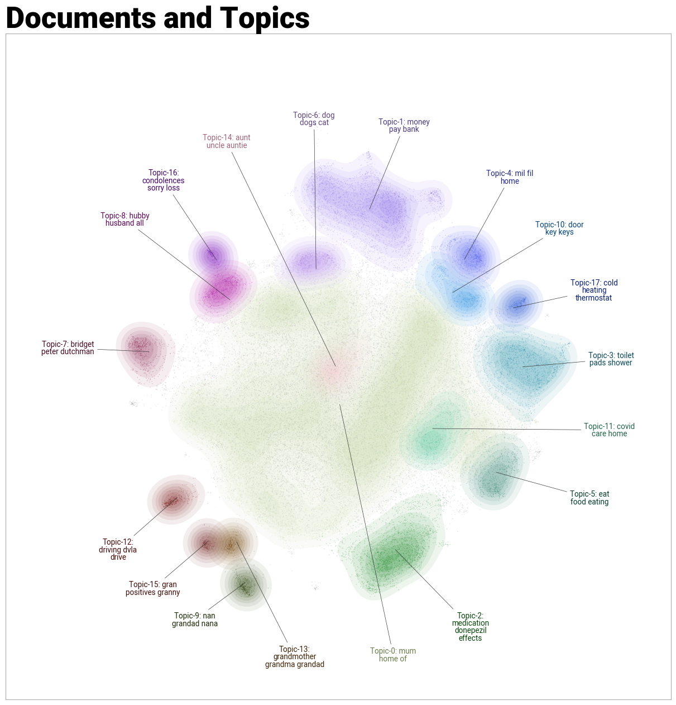

# Evolution of Topic Modeling with BERTopic

This document details the iterative process of using BERTopic to analyze discussions on a dementia forum, where patients and caregivers share their experiences and challenges. The goal was to identify meaningful commonalities and insights in the data, especially given its colloquial nature and use of abbreviations.

---

## Why BERTopic?

The choice of BERTopic was guided by the dataset’s characteristics:

- **Colloquial Language and Abbreviations**: Traditional methods like Latent Dirichlet Allocation (LDA) require extensive preprocessing, which BERTopic minimizes.
- **Embedding-Based Clustering**: BERTopic’s ability to leverage sentence transformers for semantic embeddings outperformed simpler vectorization techniques in capturing the nuances of the data.

---

## Iterative Refinement Process

### **Initial Approach**
- **Embedding Model**: Used a simple sentence transformer to map text into 384-dimensional dense vectors.
- **Clustering**: Applied UMAP for dimensionality reduction and HDBSCAN for clustering.
- **Results**:
  - Over 300 clusters were generated.
  - The intertopic distance map revealed significant overlaps.
  - Representative words included many irrelevant stop words.

**Key Issues**:
- Excessive number of clusters.
- Overlapping topics.
- Uninformative representative words.

---

### **Iteration 1: Improved Stop Word Handling**
- **Vectorizer Model**: Introduced a count vectorizer with:
  - SpaCy’s English stop words.
  - Custom stop words identified from the results.
- **Results**:
  - Improved representative words, but still over 250 clusters.
  - Persistent issues with overlapping topics.
  - Words like "years" and "now," while relevant, lacked specificity.

---

### **Iteration 2: Reducing Frequent Words with c-TF-IDF**
- **Enhancements**:
  - Replaced the count vectorizer with a c-TF-IDF model to de-emphasize frequent but less specific words.
  - Increased the `min_topic_size` to 100 to merge smaller clusters.
- **Results**:
  - Fewer clusters.
  - More coherent topics.
  - The intertopic distance map still showed some overlaps.

---

### **Iteration 3: Fine-Tuned Medical Embedding Model**
- **Embedding Model**: Switched to a sentence transformer fine-tuned on medical text.
- **Results**:
  - Reduced clusters to 17 well-defined topics.
  - Topics were distinct with minimal overlap in the intertopic distance map.
  - Representative words were clear and insightful, aligning with the forum's thematic focus.

---

## Document Cluster Visualization

To better understand the document clusters produced by the final BERTopic model, we visualize the clustering results. This visualization highlights:

- **Distinct Clusters**: Several clusters are well-defined and show clear boundaries, reflecting the specificity of topics like caregiver challenges or patient symptoms.
- **Nebulous Clusters**: A few clusters are large and less distinct, suggesting that these topics may benefit from further granular analysis or additional refinement.

### Insights
- The **distinct clusters** align with the goal of identifying meaningful and specific themes in the dataset.
- The **nebulous and large clusters** could represent overarching themes or areas where finer segmentation might reveal additional insights.
- Future iterations might explore methods to split these larger clusters further, such as adjusting `min_topic_size` or employing hierarchical clustering.

This visualization underscores the strengths of the current model while highlighting areas for potential improvement in subsequent iterations.

---

## Final Results
The final iteration produced a model that:
- Identified 17 meaningful and distinct topics.
- Demonstrated clear intertopic boundaries.
- Offered understandable and actionable insights into patient and caregiver experiences.

---

## Lessons Learned
1. **Embedding Model Choice**: Domain-specific fine-tuning significantly impacts results.
2. **Preprocessing**: Tailoring stop word lists and leveraging c-TF-IDF can enhance topic coherence.
3. **Parameter Tuning**: Adjusting parameters like `min_topic_size` helps refine cluster granularity.

---

This process showcases how iterative refinement with BERTopic can extract meaningful insights from complex datasets.