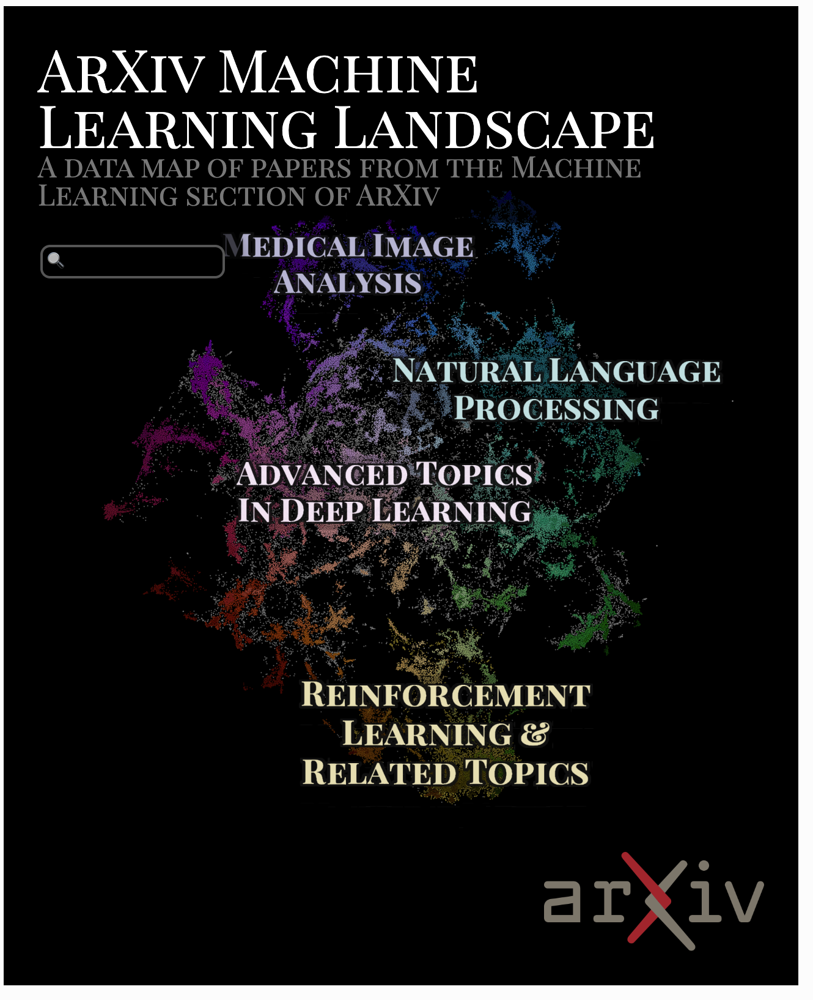
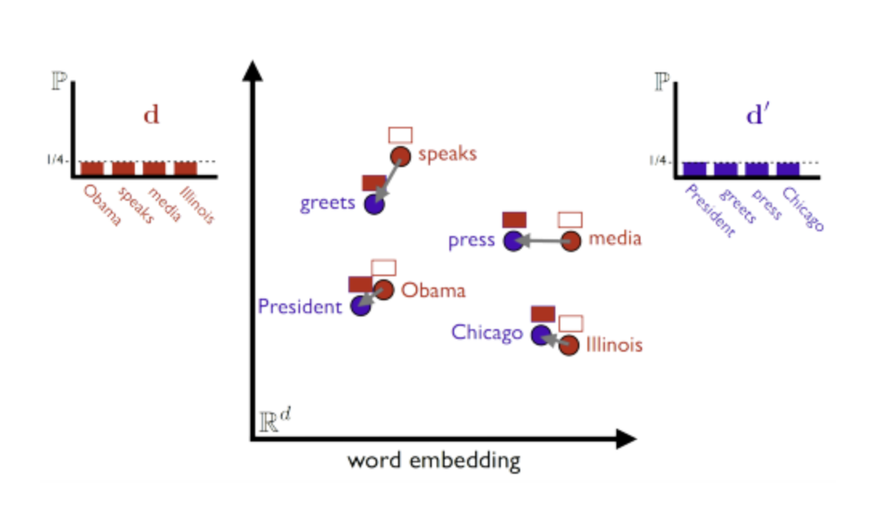

# AI Visualization Tools Overview

In our journey to understand the best visual representation for topic modeling and AI-driven insights, we explored multiple visualization tools and frameworks. Below is a summary of our findings regarding various visualization methods, their suitability, and areas where they could be improved.

# pyLDAvis

pyLDAvis is a well-known visualization tool for topic models such as Latent Dirichlet Allocation (LDA). It offers interactive visualizations that make it easy to understand the relationships between topics and words. However, we found that pyLDAvis is:

Outdated: The library hasn’t been actively maintained, which raises concerns about compatibility with newer Python versions and modern topic modeling frameworks.

Limited Integration: Its usage is limited to traditional topic modeling algorithms like LDA, and does not provide the flexibility needed to adapt to newer models like BERTopic or LLM-based clustering.

Static Visuals: Compared to modern visualizations, the interactions are limited and do not scale well to larger datasets.

# DataMapPlot

DataMapPlot is a more recent visualization tool that can be seamlessly integrated with BERTopic to create interactive maps of topics and documents. It provides several unique features, including:

Interactive Topic Maps: DataMapPlot excels in representing topics and their relationships in an interactive manner. This allows users to explore the relationships between topic clusters dynamically, revealing how different topics overlap or diverge.

Clarity in Representation: It offers a cleaner, more informative visual representation of topics, with the ability to see details such as topic composition and document contribution to topics.

Scalability: It can handle large topic models better than older tools like pyLDAvis, making it more suitable for analyzing vast collections of patient forum data.

Why DataMapPlot is Preferred: DataMapPlot provides a modern, interactive experience that allows domain experts to explore how clusters evolve over time, making it an ideal choice for analyzing complex datasets such as patient experiences.

# Gensim with Visualization Tools

Gensim is a robust library widely used for topic modeling and document similarity analysis. While Gensim itself does not include visualization features, it can be paired with other tools to achieve this. Some common visualization strategies for Gensim include:

Topic Coherence Heatmaps: You can generate heatmaps to visualize topic coherence scores, which helps understand how well-separated topics are.

Word Clouds: Word clouds provide a simple yet effective way to show the most frequent words in a topic, though they may lack depth for more nuanced insights.

Network Graphs: Pairing Gensim with libraries like NetworkX can allow visual representation of the relationships between topics in the form of graphs. However, this requires considerable custom development, and the visuals are not always as clear or intuitive as those provided by specialized tools like DataMapPlot.

Limitations: The visual rendering using Gensim alone lacks the interactivity and clarity provided by tools like DataMapPlot. Users need to integrate multiple libraries, and the effort required for effective visualization is significantly higher.
